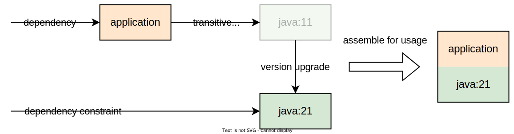

# Gradle OCI Plugin

[](https://plugins.gradle.org/plugin/io.github.sgtsilvio.gradle.oci)
[](LICENSE)
[](https://github.com/SgtSilvio/gradle-oci/actions/workflows/check.yml?query=branch%3Amain)

Gradle plugin to ease using and producing (multi-arch) OCI images without requiring external tools.

## OCI / Docker Conformance

OCI is the acronym of the [Open Container Initiative](https://github.com/opencontainers) that creates open standards around container technology, previously mainly driven by Docker.
People still commonly use the term _Docker image_ even if talking about _OCI images_.
So if you are looking for building Docker images, you are right here.
Whenever OCI is mentioned on this page, just think of it as the successor of Docker (simplified).

This plugin allows:
- Building OCI images according to the [OCI Image Format Specification](https://github.com/opencontainers/image-spec)
- Pulling and pushing images from/to OCI registries according to the [OCI Distribution Specification](https://github.com/opencontainers/distribution-spec)

## How to Use

The following is an example of a basic hello world Java application that is bundled as an OCI image and then executed as a Testcontainer in a JUnit test (using an [integration of gradle-oci and junit-jupiter](https://github.com/SgtSilvio/gradle-oci-junit-jupiter)).

`settings.gradle.kts`

```kotlin
rootProject.name = "oci-demo"
```

`build.gradle.kts`

```kotlin
plugins {
    java
    id("io.github.sgtsilvio.gradle.oci") version "0.8.0"
}

group = "org.example"
version = "1.0.0"

tasks.jar {
    manifest.attributes("Main-Class" to "org.example.oci.demo.Main")
}

repositories {
    mavenCentral()
}

dependencies {
    testImplementation("org.junit.jupiter:junit-jupiter:5.10.2")
    testImplementation("org.testcontainers:testcontainers:1.19.7")
    testImplementation("io.github.sgtsilvio:gradle-oci-junit-jupiter:0.4.0")
}

tasks.test {
    useJUnitPlatform()
}

oci {
    registries {
        dockerHub {
            optionalCredentials()
        }
    }
    imageDefinitions.register("main") {
        allPlatforms {
            parentImages {
                add("library:eclipse-temurin:21.0.2_13-jre-jammy")
            }
            config {
                entryPoint.set(listOf("java", "-jar", "app.jar"))
            }
            layers {
                layer("jar") {
                    contents {
                        from(tasks.jar)
                        rename(".*", "app.jar")
                    }
                }
            }
        }
    }
    imageDependencies.forTest(tasks.test) {
        add(project)
    }
}
```

`src/main/java/org/example/oci/demo/Main.java`

```java
package org.example.oci.demo;

public class Main {
    public static void main(final String[] args) {
        System.out.println("Hello world!");
        System.out.println(System.getProperty("java.version"));
    }
}
```

`src/test/java/org/example/oci/demo/ImageTest.java`

```java
package org.example.oci.demo;

import io.github.sgtsilvio.gradle.oci.junit.jupiter.OciImages;
import org.junit.jupiter.api.Test;
import org.testcontainers.containers.GenericContainer;

public class ImageTest {

    @Test
    void test() throws InterruptedException {
        final GenericContainer<?> container = new GenericContainer(OciImages.getImageName("example/oci-demo:1.0.0"));
        container.withLogConsumer(outputFrame -> System.out.println(outputFrame.getUtf8StringWithoutLineEnding()));
        container.start();
        Thread.sleep(100);
        container.stop();
    }
}
```

## Requirements

- Gradle 7.4 or higher

## Why Another Image Builder?

This plugin does not aim to only be "yet another image builder", but instead tries to solve usability issues of other image builders.

### OCI Images as Plain Files

OCI images are a form of distribution of your application.
You may know other distribution formats (deb, rpm, some zip/tar); all of them are just plain files with some metadata.
The same applies to OCI images: they consist of filesystem layers (tar files) and metadata (json files).

The problem here is that most image builders hide these files from the user.
This creates multiple usability issues.
First, it makes it harder to grasp what an image actually is.
While the previous point might be subjective, the software and services needed for managing the files definitely complicate the development environment.
Examples for the software in question here are the Docker daemon and registries.

This plugin simply outputs all artifacts of an OCI image as files; no Docker daemon or registry required.
Having access to the plain files of an OCI image is beneficial.
Copying files and consuming files in other tools is easy.

### Dependency Management for OCI Images

The following paragraph defines build system terminology before talking about dependency management:
Gradle projects are composed of _tasks_.
Each task can have _inputs_ and _outputs_ - these are just files.
Some task outputs are defined as outputs of the project and are then called _artifacts_.
Artifacts (usually from outside the project) can be consumed by declaring _dependencies_.
When a dependency is resolved, _module metadata_ is used to locate the artifacts and optionally _transitive dependencies_.
The dependency and all its transitive dependencies in the end resolve to a set of artifacts - files that can be used as task inputs.

Now that OCI images are just files they can be modelled as artifacts.
The OCI image artifacts can then be consumed by declaring dependencies.
Furthermore, an OCI image can then also have transitive dependencies.
Parent images (for example declared by the FROM statement in Dockerfiles) should actually be a transitive dependency.
Unfortunately, OCI images lose the metadata about their parent images.
The following diagram shows an example comparison of the representation of OCI images (top) and the representation of _OCI components_ by this plugin (bottom).


In the above diagram, image 3 has image 2 as parent image that in turn has image 1 as parent image.
Image 3 has no pointer to their parent images anymore.
It is also not possible to split the metadata of image 3 because it is a mix of its own and all parent images' metadata.
This representation is good for using the image, but not ideal for building.
The bottom part visualizes how it looks, when all three images would be built with this plugin.
Each component would only contain its own layers and its own metadata with explicit dependencies on the parent images.
When image 3 needs to be used, it needs to be assembled in the OCI image format.

While this might just seem like an extra step, it enables a lot of flexibility.
For example, it is easy to upgrade the version of a parent image independently, as can be seen in the following example diagram.



More sophisticated dependency management can be applied, such as substituting a parent image with one from a different vendor as long as it provides the same capabilities.
Also, the OCI components can be published without the need to republish all artifacts of parent images.

Furthermore, we are used to an image having at maximum one parent image, but this plugin allows to declare multiple parent image dependencies.
The dependencies then form a directed graph which will be traversed when assembling the OCI image.
The following diagram shows an example where the "application" and "java" OCI components have two parent image dependencies.


Looking into more detail, an OCI component can support multiple platforms; and each OCI component could support a different set of platforms.
When resolving the graph of OCI components, the actual set of supported platforms is determined.
The following diagram shows an example where the "app" OCI component support all platforms and the parent OCI components "java" and "os packages" support different platforms.
The intersection of the supported platforms results in an assembled multi-arch OCI image that supports 2 platforms.


This plugin uses Gradle's model to represent the OCI component artifacts and dependencies.
It does not reinvent the dependency model.
Instead, it allows to use the same dependency types for declaring dependencies on OCI component artifacts as for declaring any other dependencies on e.g. Java libraries.
The following module dependency types can be used for OCI components:
- Project dependencies: depend on OCI components produced by other Gradle subprojects.
- External module dependencies:
  - Can be downloaded from a repository that supports Gradle Module Metadata.
  - Can also be downloaded from an OCI registry acting as a special kind of a repository.
  - Can be substituted by project dependencies of included Gradle builds.

### Fine-grained Configurability

This section of the documentation is still WIP.

- flexible and explicit definition of OCI image layers
- easy to package outputs of other tasks (similar to Gradle's copyspecs)
- easy to declare file ownership and permissions
- full configuration of OCI image metadata (all properties in config, manifest and index)
- declarative

### Clear Separation Between Image and Registry

This section of the documentation is still WIP.

- split registry from image name (same as Gradle's repositories and dependencies)

### Reproducible Builds

The artifacts produced by this plugin are fully reproducible.
This includes OCI layers as well as the OCI metadata.
Reproducibility means that the exact same binaries can be recreated when using the same inputs.
More information on reproducible builds can be found on [https://reproducible-builds.org/](https://reproducible-builds.org/).

### Gradle Native Integration

This section of the documentation is still WIP.

- already described above, using Gradle's dependency model (configurations, dependencies, artifacts, attributes, capabilities)
- utilize Gradle up-to-date checks
- utilize Gradle build cache
- utilize Gradle dependency cache for images downloaded from repositories or OCI registries
- OCI images as test inputs, compatibility with Develocity test distribution

Difference to jib
- in contrast to jib not opinionated about the content/structure of OCI images, not only suitable to build java application images
- jib does not allow flexible configuration, not easy to package outputs of other tasks
- jib is not Gradle native: does not use Gradle caches and up-to-date checks
- jib does not allow to build multi-arch images as files, requires registry
